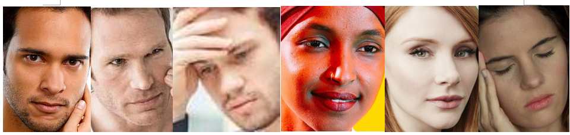
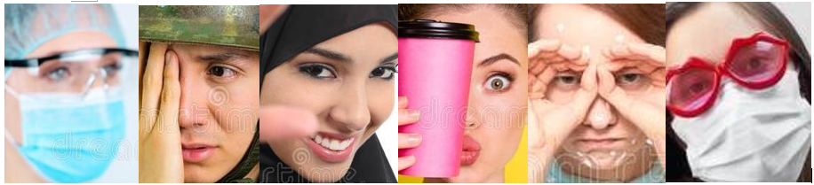

[][1]


[1]: https://drive.google.com/file/d/1bhvyVwhNGhrojxEXdSPAEX6-3dPTXg95/view?usp=share_link

# Face occlusion classification

## **Phase 1:** Classify whether face is occluded or not

```
git clone https://github.com/LamKser/face-occlusion-classification.git
cd face-occlusion-classification
```

### **:books: Dataset** 

* Crawl 9,749 images from the internet, crop the face by using [FaceMaskDetection](https://github.com/AIZOOTech/FaceMaskDetection) and divide into 2 classes:
    * `0` - Non-occluded face
    * `1` - Occluded face
<div align="center">
    
    <div>
        <strong>Figure 1: </strong>Non-occluded face example
    </div>
</div>

<div align="center">
    
    <div>
        <strong>Figure 2: </strong>Occluded face example
    </div>
</div>

* Then split the dataset into 3 sets (7 - 2 - 1):
    * `Train set` : 6,826 images
    * `Val set` : 1,945 images
    * `Test set` : 978 images

* Data structure:

    ```
    face_occlusion
    ├───Train
    │   ├───1
    │   │   ├─face_0.jpg
    │   │   ├─face_1.jpg
    │   │   └...
    │   └───0
    ├───Val
    │   ├───1
    │   └───0
    └───Test
        ├───1
        └───0
    ```
* :link: Data link: [face occlusion dataset](https://drive.google.com/file/d/1bhvyVwhNGhrojxEXdSPAEX6-3dPTXg95/view?usp=share_link)

### **:building_construction: Train model**
* Use the pretrained DenseNet169 Model (default):

    ```
    python main.py --train-path face_occlusion/Train \
                   --val-path face_occlusion/Val \
                   --weight-dir path/weight/folder \
                   --weight-name {name_the_file}.pt \
                   --mode train
    ```
* In case you want to train the model from scratch, run the command below:

    ```
    python main.py --train-path face_occlusion/Train \
                   --val-path face_occlusion/Val \
                   --weight-dir path/weight/folder \
                   --weight-name {name_the_file}.pt \
                   --pretrained 0 \
                   --mode train
    ```

* Show the training and validation progress

    ```
    tensorboard --logdir logger
    ```
### **:chart_with_upwards_trend: Test model**
* Test the model

    ```
    python main.py --test-path face_occlusion/Test \
                   --csv {predict_file}.csv \
                   --weight-dir path/weight/folder \
                   --weight-name {weight_file}.pt \
                   --mode test
    ```
* Test single image

    ```
    python main.py --image-path path/to/your/image \
                   --weight-dir path/weight/folder \
                   --weight-name {weight_file}.pt \
                   --mode image
    ```

### **Note:** 
* To use other model or change some parameters, you can edit in `config.yaml`
* Other model: resnet18, resnet50
